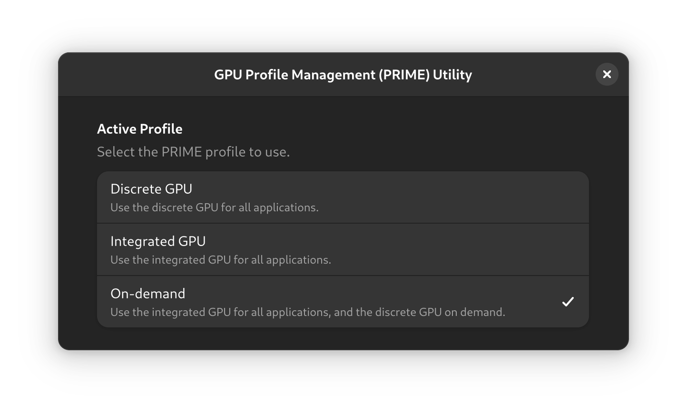

<div align="center">
    
    <h1>Vanilla PRIME Utility</h1>
    <p>A frontend in GTK 4 and Libadwaita to switch PRIME profiles.</p>
    <br />
    
</div>

## Build
### Dependencies
- build-essential
- meson
- libadwaita-1-dev
- gettext
- desktop-file-utils
- nvidia-prime

### Build
```bash
meson build
ninja -C build
```

### Install
```bash
sudo ninja -C build install
```

## Run
```bash
vanilla-prime-utility

# embedded mode
vanilla-prime-utility --embedded
```
