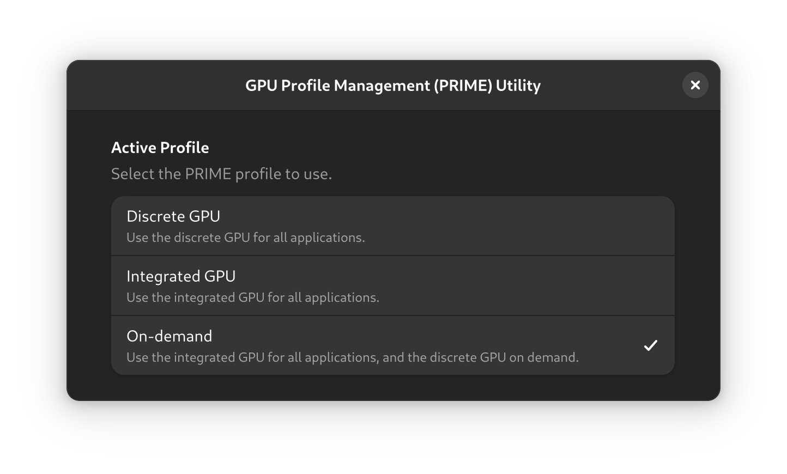

<div align="center">
    
    <h1>Vanilla PRIME Utility</h1>
    
[![Translation Status][weblate-image]][weblate-url]

[weblate-url]: https://hosted.weblate.org/engage/vanilla-os/
[weblate-image]: https://hosted.weblate.org/widgets/vanilla-os/-/vanilla-prime-utility/svg-badge.svg

<p>A frontend in GTK 4 and Libadwaita to switch PRIME profiles.</p>
<br />

</div>

## Build

### Dependencies

- build-essential
- meson
- libadwaita-1-dev
- gettext
- desktop-file-utils
- nvidia-prime

### Build

```bash
meson build
ninja -C build
```

### Install

```bash
sudo ninja -C build install
```

## Run

```bash
vanilla-prime-utility

# embedded mode
vanilla-prime-utility --embedded
```

## Other distributions

This utility works on any Debian-based distribution, just note that `NoDisplay=true` is set
in the desktop file, since Vanilla OS uses the embedded mode. If you want to use the
standalone mode, you can remove this line and the icon will be shown in the applications
menu of your distribution.

## Use of Generative AI

Maintainers may use generative AI tools as assistants while working on vanilla-prime-utility. Non-trivial assisted commits disclose the tool, model, and scope of the work.

AI tools may assist with code comments, documentation, repetitive code, and issue triage. Maintainers make project decisions and review every assisted change before it is merged.

Use these trailers for non-trivial assisted commits:

```plain
Assisted-by: <tool>:<model-version>
AI-Scope: <what the tool generated and the prompt or a short prompt summary>
```

Single-line completions, renames, and formatting changes do not need trailers.

Coding agents must also follow [AGENTS.md](AGENTS.md) before changing files,
creating commits, or opening pull requests.
